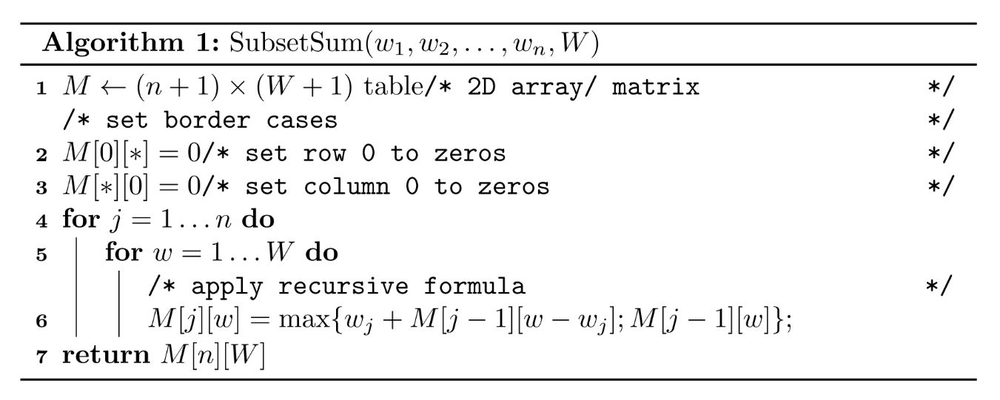
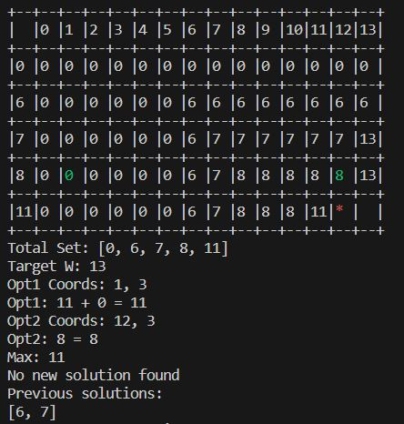

# Subset Sum Problem

## Problem Statement

Given a set of non-negative integers, and a value sum, determine if there is a subset of the given set with sum equal to given sum.

## Example

Input: set[] = {3, 34, 4, 12, 5, 2}, sum = 9
Output: True
There is a subset (4, 5) with sum 9.

## Algorithm

I know right. It's a bit tedious to trace, visualize, and understand. Hence, this repo! I originally built this code to help myself understand the algorithm better. I hope it helps you too!

## Usage

The repo is written in Java 8. Just run the Main class and the terminal-based UI will guide you through the rest.

## Notes

There is only so much space in the terminal. Hence, the number limitations, I put. These can be changed, just be careful as tables can get big quickly and mess with your output.

## Sample Output

## Conclusion

I hope this helps you understand the algorithm better! And please let me know if you find any bugs or have any suggestions. Thanks!
